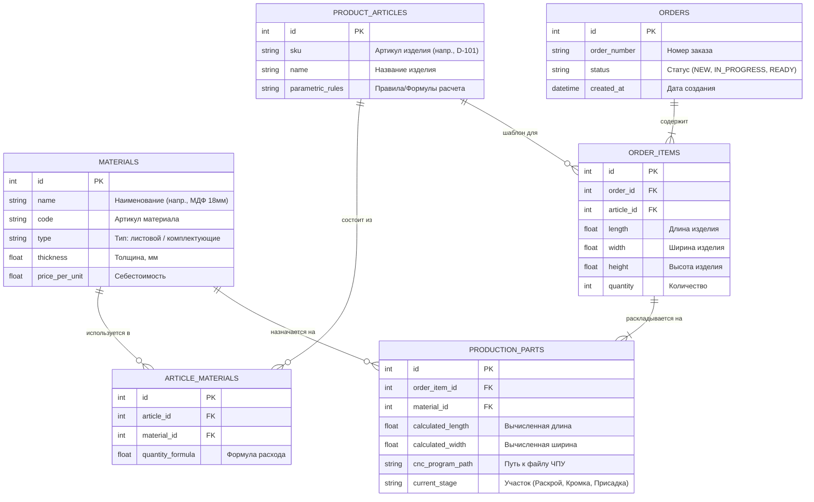

# Архитектура базы данных SBProduction (Manufacturing Core)

```mermaid
erDiagram
    %% Справочники и артикулы
    MATERIALS {
        int id PK
        string name "Наименование (напр., МДФ 18мм)"
        string code "Артикул материала"
        string type "Тип: листовой / комплектующие"
        float thickness "Толщина, мм"
        float price_per_unit "Себестоимость"
    }

    PRODUCT_ARTICLES {
        int id PK
        string sku "Артикул изделия (напр., D-101)"
        string name "Название изделия"
        string parametric_rules "Правила/Формулы расчета"
    }

    ARTICLE_MATERIALS {
        int id PK
        int article_id FK
        int material_id FK
        float quantity_formula "Формула расхода"
    }

    %% Заказы
    ORDERS {
        int id PK
        string order_number "Номер заказа"
        string status "Статус (NEW, IN_PROGRESS, READY)"
        datetime created_at "Дата создания"
    }

    ORDER_ITEMS {
        int id PK
        int order_id FK
        int article_id FK
        float length "Длина изделия"
        float width "Ширина изделия"
        float height "Высота изделия"
        int quantity "Количество"
    }

    %% Производство и ЧПУ
    PRODUCTION_PARTS {
        int id PK
        int order_item_id FK
        int material_id FK
        float calculated_length "Вычисленная длина"
        float calculated_width "Вычисленная ширина"
        string cnc_program_path "Путь к файлу ЧПУ"
        string current_stage "Участок (Раскрой, Кромка, Присадка)"
    }

    %% Связи
    PRODUCT_ARTICLES ||--o{ ARTICLE_MATERIALS : "состоит из"
    MATERIALS ||--o{ ARTICLE_MATERIALS : "используется в"
    ORDERS ||--|{ ORDER_ITEMS : "содержит"
    PRODUCT_ARTICLES ||--o{ ORDER_ITEMS : "шаблон для"
    ORDER_ITEMS ||--|{ PRODUCTION_PARTS : "раскладывается на"
    MATERIALS ||--o{ PRODUCTION_PARTS : "назначается на"
```